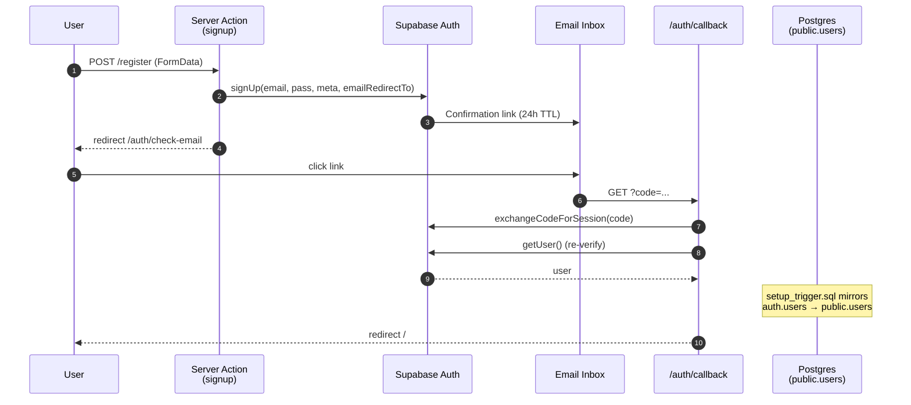
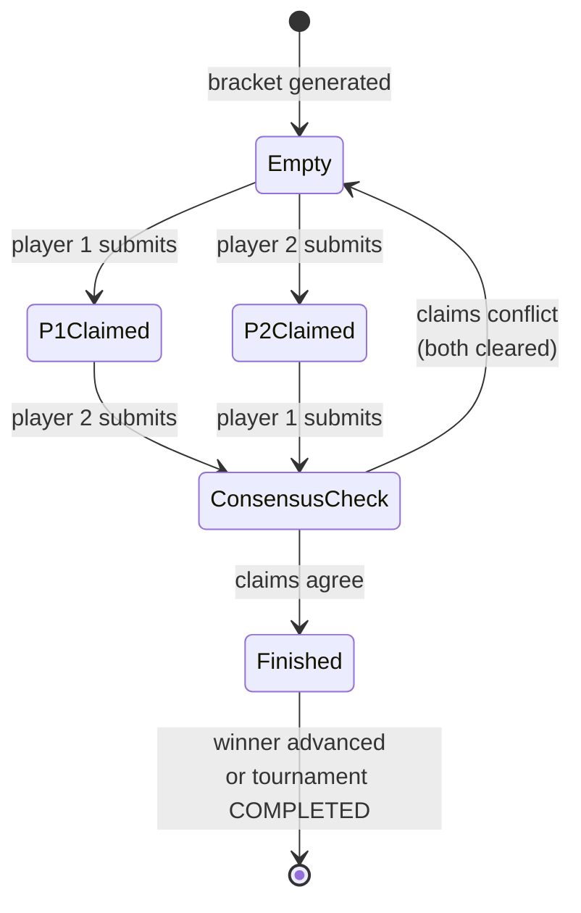

# 🏆 Tournament Manager

Self-serve platform for hosting single-elimination tournaments — from sign-up to final.

[](https://nextjs.org/)
[](https://react.dev/)
[](https://www.typescriptlang.org/)
[](https://www.prisma.io/)
[](https://supabase.com/)
[](https://www.postgresql.org/)
[](https://tailwindcss.com/)
[](https://www.docker.com/)
[](LICENSE)

Organizers schedule tournaments, set participant caps, and pin a location on a map. Players register with email confirmation, apply with a license number and ranking, and — once the deadline passes — get auto-seeded into a canonical single-elimination bracket. Both players in a match independently confirm the winner; conflicting reports cancel and re-prompt; matching reports advance the winner to the next round.

## 🧠 Architecture

A single Next.js 16 App Router deployment backed by Supabase (Postgres + Auth + Object Storage). Reads use React Server Components; writes use Server Actions validated with Zod at the boundary. Prisma owns the typed database access path; the Supabase client is reserved for Auth and Storage. A Vercel Cron pings the app every ten minutes to seed any tournament whose application deadline has passed, with a manual fallback button for organizers who don't want to wait. The rest of this README pulls each non-trivial subsystem apart.

## 🔬 Advanced Features

**TL;DR for the in-a-hurry reader:**
- Email-confirmed auth flow where the callback double-verifies the session before trusting it
- Canonical (recursive interleave) bracket seeding, with byes assigned to top seeds and pre-propagated into round 2
- Two-player consensus protocol for match results — conflicting votes clear and re-prompt
- Race-safe applications: DB-level unique constraints, Prisma `P2002` translated to per-field UI errors

### Authentication Lifecycle

Email/password auth with a 24-hour confirmation TTL (Supabase default) and a password-reset flow gated by middleware. Three subtle pieces are worth surfacing:

1. **Site-URL parameterization** — Supabase needs an absolute `emailRedirectTo`, which can't be hardcoded if the same build runs in preview + production. [`getSiteURL()`](src/lib/url.ts) reads `NEXT_PUBLIC_SITE_URL` and falls back to localhost; the signup action embeds it into `emailRedirectTo` before calling Supabase.
2. **Callback double-verification** — `exchangeCodeForSession` writes a cookie, but Supabase has had quiet-failure modes where the session token is set even though the user object is unusable. The callback re-checks with `getUser()` before redirecting, so a half-broken handshake lands on `/auth/auth-code-error` instead of a logged-in shell.
3. **Reset-password gating** — the password-reset email links to `/auth/callback?next=/reset-password`. The middleware in [src/lib/supabase/middleware.ts](src/lib/supabase/middleware.ts) bounces unauthenticated requests for `/reset-password` back to `/login`, so a stolen reset URL alone can't change a password.



Callback re-verification ([src/app/auth/callback/route.ts](src/app/auth/callback/route.ts)):

```ts
const { error } = await supabase.auth.exchangeCodeForSession(code)
if (!error) {
  const { data: { user } } = await supabase.auth.getUser()
  if (user) return NextResponse.redirect(`${origin}${next}`)
}
return NextResponse.redirect(`${origin}/auth/auth-code-error`)
```

### Bracket Mathematics

The bracket lives in two halves: a pure module ([src/lib/tournament/bracket.ts](src/lib/tournament/bracket.ts)) that does the math without touching the DB, and a writer ([src/lib/tournament/generate.ts](src/lib/tournament/generate.ts)) that materializes the result into `Match` rows.

The slot order for a bracket of `size = 2^k` is built by recursive interleave: for each seed `s` in the current bracket of size `n`, the larger bracket places `s` next to its "complement" `2n + 1 − s`. For `size = 8` the resulting order is `[1, 8, 4, 5, 2, 7, 3, 6]`, giving pairings `(1v8), (4v5), (2v7), (3v6)` — and the invariant that at every recursion level a seed sits next to its complement means #1 and #2 can only meet in the final.

```ts
export function seedOrder(size: number): number[] {
  if (size < 2 || (size & (size - 1)) !== 0) {
    throw new Error(`bracket size must be a power of two ≥ 2, got ${size}`)
  }
  let order = [1, 2]
  while (order.length < size) {
    const top = order.length * 2 + 1
    const next: number[] = []
    for (const s of order) next.push(s, top - s)
    order = next
  }
  return order
}
```

A bracket with `n` participants where `n` isn't a power of two needs `2^⌈log₂ n⌉ − n` byes. The slot helper falls through to `null` for seeds past the participant count — and since those bottom-numbered seeds pair against the top by the order invariant, byes automatically land on the top seeds, which is the standard handling.

**Bye propagation.** A bye match has `winnerId` set at generation time, but the original draft left the *next-round* slot empty — producing "Bye vs TBD" labels until the other half of the sub-bracket resolved. The writer now walks each round-1 auto-winner forward through `nextSlot()` and pre-fills the downstream `player1Id` / `player2Id` before the bulk insert:

```ts
for (const { position, winnerId } of round1Winners) {
  if (!winnerId) continue
  const next = nextSlot(1, position)
  const placeholder = placeholders.get(`${next.round}:${next.position}`)
  if (!placeholder) continue
  if (next.slot === 'player1') placeholder.player1Id = winnerId
  else placeholder.player2Id = winnerId
}
```

The whole tree — round 1 with auto-winners, rounds 2…N with bye pre-fills — is inserted in a single `createMany` inside the same `$transaction` that flips the tournament status to `LADDER_GENERATED`.

### Match Consensus Protocol

Each `Match` has two claim columns: `player1Result` and `player2Result`. Both players vote independently. The system reconciles claims into a `winnerId` only when they agree. Disagreement clears both votes — the pair re-enters results.



`recordResult` in [src/lib/tournament/advance.ts](src/lib/tournament/advance.ts) drives all transitions inside `prisma.$transaction` — a match cannot reach `Finished` without its downstream slot being filled atomically:

```ts
const fresh = await tx.match.findUniqueOrThrow({
  where: { id: matchId },
  select: { player1Result: true, player2Result: true },
})
if (!fresh.player1Result || !fresh.player2Result) return

if (fresh.player1Result !== fresh.player2Result) {
  await tx.match.update({
    where: { id: matchId },
    data: { player1Result: null, player2Result: null },
  })
  return
}

await tx.match.update({ where: { id: matchId }, data: { winnerId: fresh.player1Result } })
// …then either advance to next round, or mark tournament COMPLETED if this was the final.
```

The mapping from a round-`r` position `p` to its round-`r+1` parent uses `position = ⌈p/2⌉` (odd → player1, even → player2). The same `nextSlot()` helper that bye-propagation uses, so the two paths agree by construction.

### Concurrency, Cron & Status Machine

**Concurrent applications.** Two users submit `applyForTournament` in the same millisecond, both claiming `currentRanking: 7`. An in-memory pre-check would race. The schema declares `@@unique([tournamentId, currentRanking])`, `@@unique([tournamentId, licenseNumber])`, and `@@unique([userId, tournamentId])`; the action catches Prisma's `P2002` and surfaces a per-field message:

```ts
function translateUniqueViolation(e: Prisma.PrismaClientKnownRequestError): string {
  const target = (e.meta?.target ?? []) as string[]
  if (target.includes('currentRanking')) return 'That ranking is already taken for this tournament'
  if (target.includes('licenseNumber')) return 'That license number is already registered'
  if (target.includes('userId')) return 'You are already registered for this tournament'
  return 'Application conflict'
}
```

**Cron-driven bracket generation.** `vercel.json` schedules a GET on [/api/cron/generate-ladders](src/app/api/cron/generate-ladders/route.ts) every ten minutes. Three properties matter:

- *Authorization* — `Authorization: Bearer …` is compared against `CRON_SECRET`. No secret env → 500; mismatched bearer → 401.
- *Idempotency* — `generateBracketForTournament` short-circuits on `status !== OPEN`, so cron retries are no-ops. The same property lets the organizer fire "Generate Ladder" manually; whoever wins the race triggers the actual work.
- *No queue* — at this scale, a SQL query on a deadline-indexed column beats a job runner. The price is up-to-ten-minute latency, acceptable given the human timescale of tournaments.

**Status state machine.**

| From | To | Trigger |
| --- | --- | --- |
| `OPEN` | `LADDER_GENERATED` | Cron tick *or* organizer's "Generate Ladder" button, both routed through [`generateBracketForTournament`](src/lib/tournament/generate.ts) |
| `LADDER_GENERATED` | `COMPLETED` | Final-round match resolves consensus in [`recordResult`](src/lib/tournament/advance.ts) |

## 🛠️ Implementation Notes

**Anti-overflow date parsing.** `new Date("20202-01-01")` returns a valid Date in the year 20202 — JavaScript's parser is liberal with year width. Without a guard, that string would feed `Prisma.TournamentWhereInput.date.gte` and either crash the planner or scan the entire index. The home page rejects anything that doesn't match the strict ISO regex:

```ts
const ISO_DATE = /^\d{4}-\d{2}-\d{2}$/
function parseDate(raw: string | undefined): Date | undefined {
  if (!raw || !ISO_DATE.test(raw)) return undefined
  const d = new Date(raw)
  return Number.isNaN(d.getTime()) ? undefined : d
}
```

[`<Search>`](src/components/Search.tsx) also debounces input by 300ms and routes filters through `URLSearchParams` so back/forward stays useful.

**Sponsor logo upload pipeline.** Multi-file uploads inside [the create-tournament action](src/app/tournaments/create/actions.ts) run in parallel via `Promise.all` to Supabase Storage. Each path is prefixed with `${Date.now()}-${crypto.randomUUID()}-` so two organizers uploading `logo.png` the same second can't collide, and `upsert: false` is the safety net if the prefix ever did. Public URLs land in `Tournament.sponsorLogos: string[]` — a Postgres array, no join table.

**LocationPicker — ref over state.** The map-pin component lets organizers click anywhere on a Google Map to drop a marker; the marker has to survive between clicks and be destroyable on the next click. Storing it in `useState` is wrong — the click listener registered inside `useEffect` closes over the marker value at *registration time* (always `null`), and React `setState` can't reach back into already-registered listeners. [The component](src/components/LocationPicker.tsx) uses `useRef<google.maps.Marker | null>`, so the listener reads `markerRef.current` fresh on every call.

## 🛠️ Tech Stack

### Frontend
- Next.js 16 (App Router, Server Components, Server Actions)
- React 19 with the React Compiler enabled
- `useActionState` + `useFormStatus` for form-pending state without prop drilling — see [SubmitButton](src/components/SubmitButton.tsx)
- Tailwind CSS v4
- Google Maps JavaScript SDK + Embed API

### Backend
- Supabase Postgres accessed through Prisma 5.10
- Supabase Auth (email/password with email confirmation, password reset)
- Supabase Storage (sponsor logos)
- Zod schemas at every server-action boundary — see [validation.ts](src/lib/validation.ts)
- Vercel Cron for deadline-driven bracket generation

### Infrastructure
- Vercel-friendly (`proxy.ts` middleware, cron schedule in `vercel.json`)
- Multi-stage Dockerfile + docker-compose for self-hosting (`output: 'standalone'`)

## 📁 Project Structure

```
tournament-manager-nextjs/
├── prisma/
│   └── schema.prisma         # Users, Tournaments, Participants, Matches
├── src/
│   ├── app/
│   │   ├── auth/             # Supabase callback + status pages
│   │   ├── api/cron/         # Deadline cron for ladder generation
│   │   ├── login, register, forgot-password, reset-password/
│   │   ├── tournaments/      # List, create, detail, apply, edit
│   │   ├── matches/[id]/     # Per-match voting page
│   │   ├── profile/          # Dashboard: organised, joined, upcoming
│   │   ├── layout.tsx, page.tsx, not-found.tsx, error.tsx
│   ├── components/           # UI components (bracket, forms, header, …)
│   ├── lib/
│   │   ├── prisma.ts, url.ts, constants.ts, forms.ts, validation.ts
│   │   ├── supabase/         # Server + middleware Supabase clients
│   │   ├── auth/actions.ts   # signOut
│   │   └── tournament/       # bracket.ts, generate.ts, advance.ts
│   └── proxy.ts              # Next.js 16 middleware (cookie refresh + guards)
├── setup_trigger.sql         # auth.users → public.users mirror trigger
├── vercel.json               # Cron schedule
├── Dockerfile, docker-compose.yml, .dockerignore
└── .env.example
```

## ⚙️ Environment Variables

| Variable | Purpose |
|---|---|
| `DATABASE_URL` | Pooled Supabase Postgres URL used at runtime |
| `DIRECT_URL` | Direct Postgres URL used by `prisma migrate` |
| `NEXT_PUBLIC_SUPABASE_URL` | Supabase project URL (public) |
| `NEXT_PUBLIC_SUPABASE_ANON_KEY` | Supabase anon key (public) |
| `NEXT_PUBLIC_GOOGLE_MAPS_API_KEY` | Optional — enables the location picker and embed |
| `NEXT_PUBLIC_SITE_URL` | Absolute base URL for email-confirmation callbacks |
| `CRON_SECRET` | Shared secret for the Vercel Cron endpoint |

Copy `.env.example` to `.env.local` for local dev or `.env` for Docker.

## 🚀 Setup

### Prerequisites
- Node.js 20+
- npm 10+
- A Supabase project (free tier is fine)

### Local development

```bash
git clone https://github.com/jesiekjakub/tournament-manager-nextjs.git
cd tournament-manager-nextjs
npm install
cp .env.example .env.local                 # then fill in real values

npx prisma db push                         # creates the schema in Supabase
psql "$DIRECT_URL" -f setup_trigger.sql    # mirrors auth.users → public.users

npm run dev                                # http://localhost:3000
```

In the Supabase dashboard, create a public Storage bucket named `sponsor-logos` so the create-tournament form has somewhere to upload to.

### Docker

```bash
docker compose up --build
```

The container reads from `.env` and exposes the app on port 3000.

## 🏛️ Key Architecture Decisions

- **Server Actions over REST endpoints.** Every mutation is a `'use server'` function colocated with the page that triggers it.
- **Zod schemas at the boundary, Prisma types inside.** Server actions parse `FormData` through a Zod schema first; downstream code only sees fully-typed inputs. The same approach gates the cron endpoint's `Authorization` header.
- **Database is the authority on uniqueness.** Composite unique indexes + `P2002` translation — no in-memory pre-check race windows.
- **Deadline-driven cron, not a queue.** A SQL filter `status = OPEN AND deadline < now()` is simpler than a job runner at this scale. Idempotent, so retries and manual triggers are safe.
- **`COMPLETED` is terminal.** No `CANCELLED` state — admin-side cancellation would need an additional path that isn't in scope; organizer editing is locked once status leaves `OPEN`.
- **Standalone Next output for Docker.** `next.config.ts` sets `output: 'standalone'`, so the runtime image copies only `.next/standalone` plus `public/` and a few Prisma binaries.
- **`proxy.ts` instead of `middleware.ts`.** Next.js 16 renamed the middleware entrypoint; this repo uses the new name.

## 📚 References

- [Next.js App Router documentation](https://nextjs.org/docs/app)
- [Supabase server-side auth helpers](https://supabase.com/docs/guides/auth/server-side)
- [Prisma + Next.js best practices](https://www.prisma.io/docs/guides/other/help-articles/nextjs-prisma-client-dev-practices)
- [Single-elimination tournament — Wikipedia](https://en.wikipedia.org/wiki/Single-elimination_tournament)

## 📝 License

[MIT](LICENSE)
